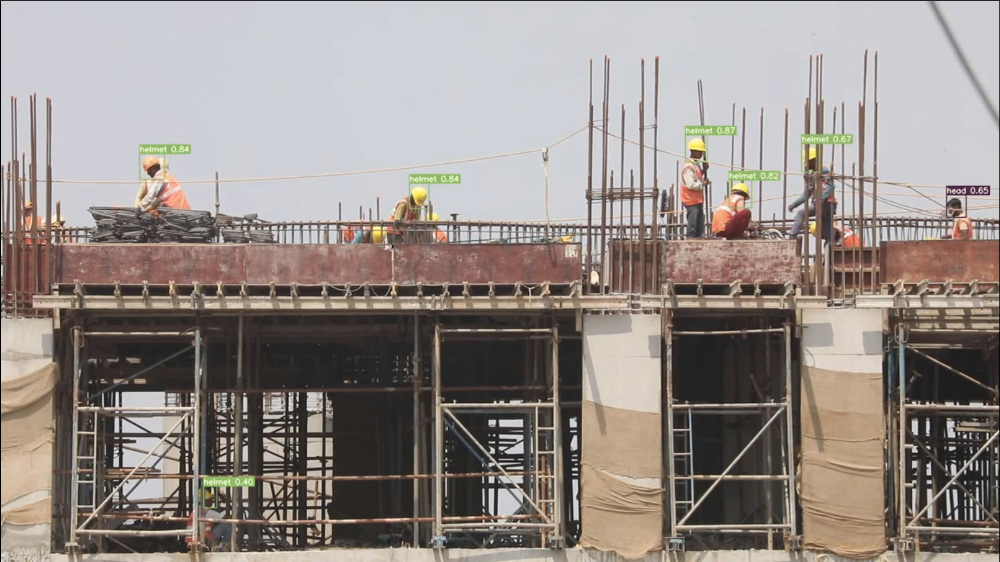

# YOLOv7 on Custom Dataset
Yolo is a Computer vision model that predicts the place of objects inside an image.

here is a comparison between YOLOv5 and YOLOv7.

It's used for real time classifications, through live camera input or video input.

We used transfer learning when training our model to make it learn faster and focus on specific classes in our case "Helmet & head" classes.

## 📁 DataSet

I used the data set from Roboflow to train our model, link for the [dataset](https://universe.roboflow.com/joseph-nelson/hard-hat-workers/dataset/13).

## 🧠 Training

I used Kaggle to train my model then downloaded the weights and used those weights in Inference link to those trained weights:

Link to the [notebook](https://www.kaggle.com/code/roboticscorner/yolov7) used in training:

You can use it to train your own custom data and download the weights after training and then use inference on it.

## 🎯 Inference

I did inference using 2 ways one directly using the detect.py in the repository and the other is by running a loop manually decoding the predictions, drawing the bounding boxes on the frame and everything.

Using the detect.py is so much faster than the manual way keep that in mind when running the code, you can find the 2 versions here:

1) [Using detect.py](https://github.com/SalmaNasser123/Inference_Tests/blob/main/yolov7/Files_and_Notebooks/Inference_Detect.ipynb)

2) [Using manual detection](https://github.com/SalmaNasser123/Inference_Tests/blob/main/yolov7/Files_and_Notebooks/Inference_manually.py)

It's also better to have a GPU to do the inference with so it's real time.

Sample of the output:

## References
1) [YOLOv7 Paper](https://arxiv.org/abs/2207.02696)
2) [YOLOv7 Implementation](https://github.com/WongKinYiu/yolov7)
3) [Training YOLOv7 on Custom Dataset Notebook](https://colab.research.google.com/drive/1X9A8odmK4k6l26NDviiT6dd6TgR-piOa?ref=blog.roboflow.com)
4) [Inference of YOLOv7 Manually](http://edparcell.com/pgw-yolov7.html)
5) [Inference of YOLOv7 with detect.py](https://stackabuse.com/real-time-object-detection-inference-in-python-with-yolov7/)

## Maintained by

  

