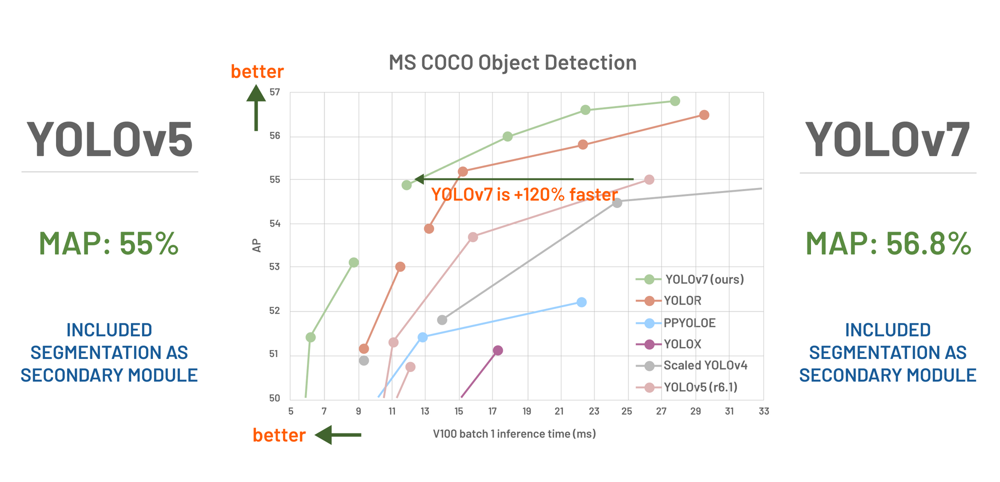

# Yolov7
Yolo is a Computer vision model that pridects the place of objects inside an image.

here is a comparizon between YOLOv5 and YOLOv7.

It's used for real time classfications, through live camera input or video input.

We used transfer learning when training our model to make it learn faster and focus on specfic classes in our case "Helmet & head" classes.

## DataSet

I used the data set from Roboflow to train our model, link for the dataset:

https://universe.roboflow.com/joseph-nelson/hard-hat-workers/dataset/13

## Training

I used Kaggle to train my model then downloaded the weights and used those weights in Inference link to those trained weights:

Link to the notebook used in training:
https://www.kaggle.com/code/roboticscorner/yolov7

You can use it to train your own custom data and download the weights after training and then use inference on it.

## Inference

I did inference using 2 ways one directly using the detect.py in the repositry and the other is by running a the loop manually decoding the predications, drawing the bounding boxes on the frame and everything.

Using the detect.py is so much faster than the manual way keep that in mind when running the code, you can find the 2 versions here:

using detect.py: 

It's also better to have a GPU to do the inference with so it's real time.
